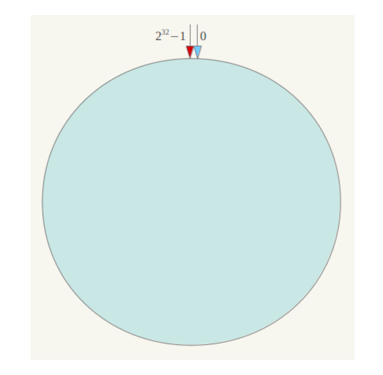
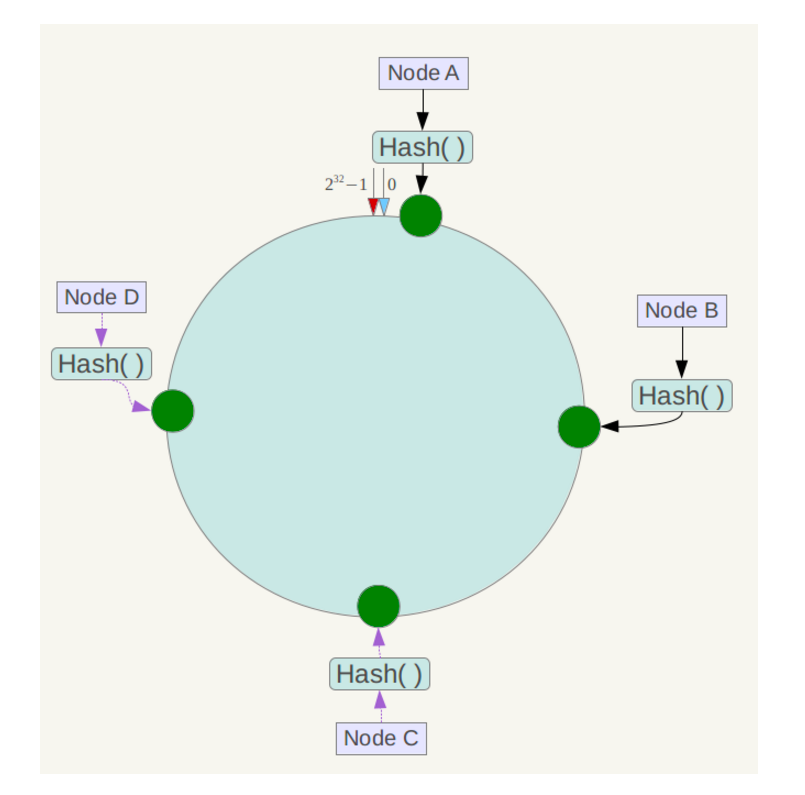
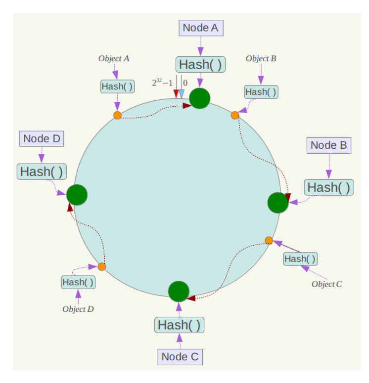
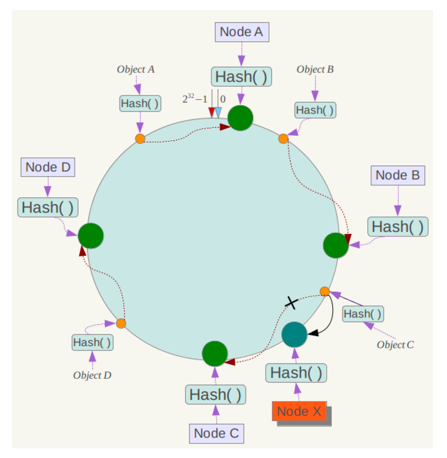
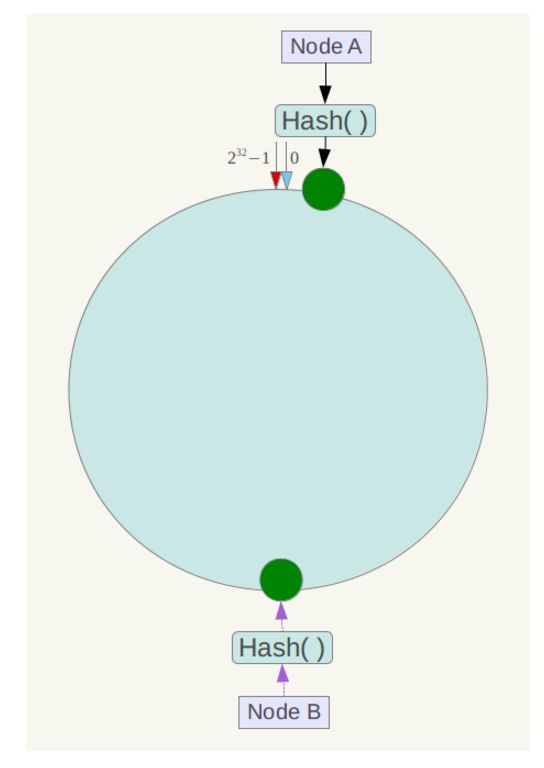
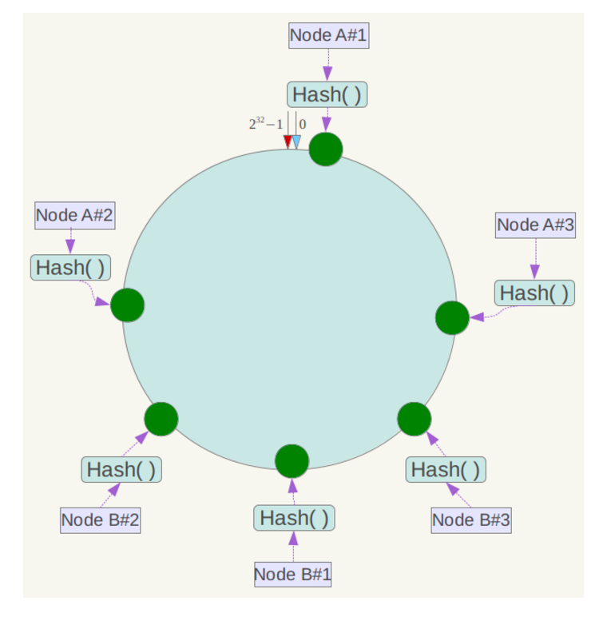
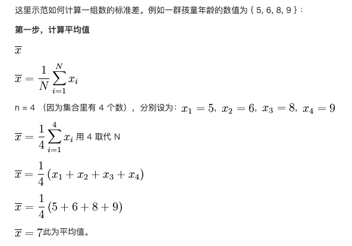
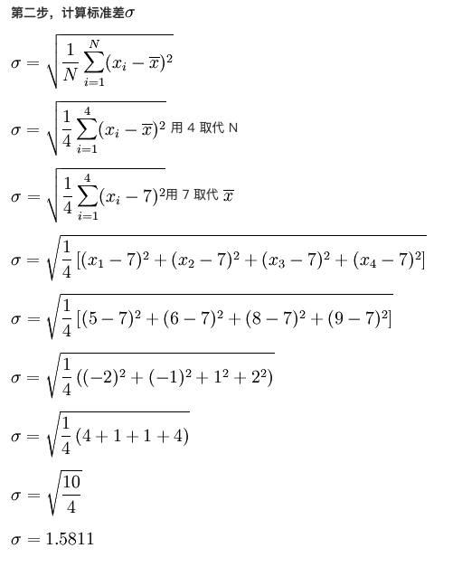
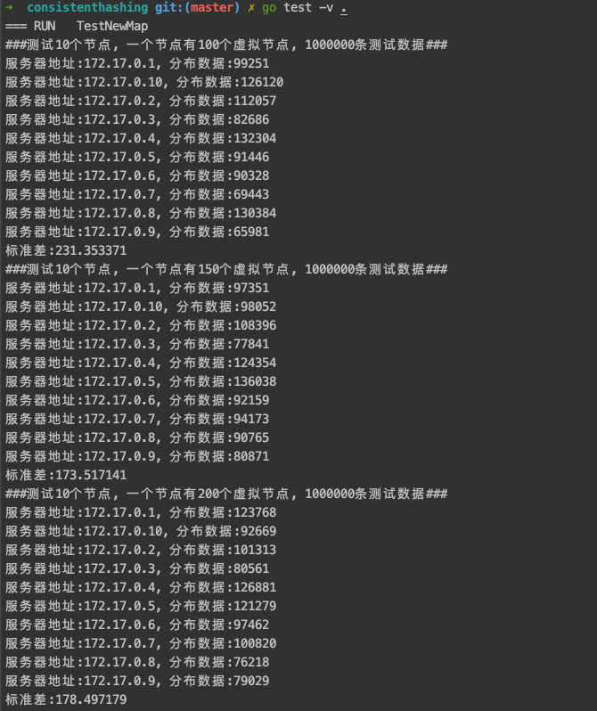

# 一、一致性 hash 原理
一致性哈希算法（Consistent Hashing）最早在论文《Consistent Hashing and Random Trees: Distributed Caching Protocols for Relieving Hot Spots on the World Wide Web》中被提出。简单来说，一致性哈希将整个哈希值空间组织成一个虚拟的圆环，如假设某哈希函数 H 的值空间为 0-2^32-1（即哈希值是一个 32 位无符号整形），整个哈希空间环如下：


整个空间按顺时针方向组织。0 和 232-1 在零点中方向重合。

下一步将各个服务器使用 Hash 进行一个哈希，具体可以选择服务器的 ip 或主机名作为关键字进行哈希，这样每台机器就能确定其在哈希环上的位置，这里假设将上文中四台服务器使用 ip 地址哈希后在环空间的位置如下：



接下来使用如下算法定位数据访问到相应服务器：将数据 key 使用相同的函数 Hash 计算出哈希值，并确定此数据在环上的位置，从此位置沿环顺时针“行走”，第一台遇到的服务器就是其应该定位到的服务器。

例如我们有 Object A、Object B、Object C、Object D 四个数据对象，经过哈希计算后，在环空间上的位置如下：



根据一致性哈希算法，数据 A 会被定为到 Node A 上，B 被定为到 Node B 上，C 被定为到 Node C 上，D 被定为到 Node D 上。

下面分析一致性哈希算法的容错性和可扩展性。现假设 Node C 不幸宕机，可以看到此时对象 A、B、D 不会受到影响，只有 C 对象被重定位到 Node D。一般的，在一致性哈希算法中，如果一台服务器不可用，则受影响的数据仅仅是此服务器到其环空间中前一台服务器（即沿着逆时针方向行走遇到的第一台服务器）之间数据，其它不会受到影响。

下面考虑另外一种情况，如果在系统中增加一台服务器 Node X，如下图所示：



此时对象 Object A、B、D 不受影响，只有对象 C 需要重定位到新的 Node X 。一般的，在一致性哈希算法中，如果增加一台服务器，则受影响的数据仅仅是新服务器到其环空间中前一台服务器（即沿着逆时针方向行走遇到的第一台服务器）之间数据，其它数据也不会受到影响。

综上所述，一致性哈希算法对于节点的增减都只需重定位环空间中的一小部分数据，具有较好的容错性和可扩展性。

另外，一致性哈希算法在服务节点太少时，容易因为节点分部不均匀而造成数据倾斜问题。例如系统中只有两台服务器，其环分布如下，



此时必然造成大量数据集中到 Node A 上，而只有极少量会定位到 Node B 上。为了解决这种数据倾斜问题，一致性哈希算法引入了虚拟节点机制，即对每一个服务节点计算多个哈希，每个计算结果位置都放置一个此服务节点，称为虚拟节点。具体做法可以在服务器 ip 或主机名的后面增加编号来实现。例如上面的情况，可以为每台服务器计算三个虚拟节点，于是可以分别计算 “Node A#1”、“Node A#2”、“Node A#3”、“Node B#1”、“Node B#2”、“Node B#3”的哈希值，于是形成六个虚拟节点：


同时数据定位算法不变，只是多了一步虚拟节点到实际节点的映射，例如定位到“Node A#1”、“Node A#2”、“Node A#3”三个虚拟节点的数据均定位到 Node A 上。这样就解决了服务节点少时数据倾斜的问题。在实际应用中，通常将虚拟节点数设置为 32 甚至更大，因此即使很少的服务节点也能做到相对均匀的数据分布。

# 二、标准差计算




# 三、测试
## 3.1 修改consistenthashing_test.go参数
```bash
// 虚拟节点列表
replicasList := []int{100, 150, 200}

// 真实节点数量
nodeNum := 10

// 测试数据总数
testCount := 1000000
```
## 3.2 执行命令
```bash
cd consistenthashing/
go test -v .
```
## 3.3 测试结果
